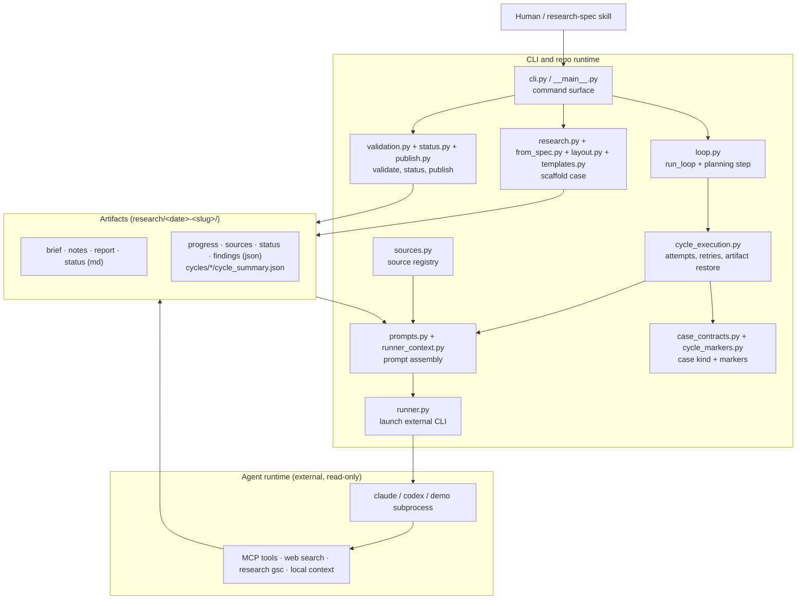
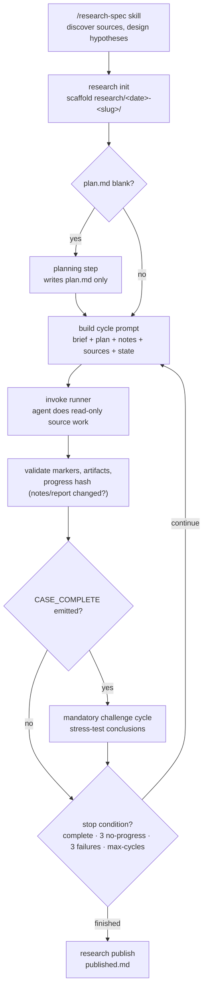
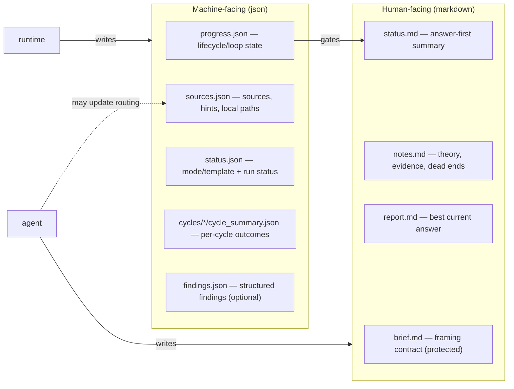

# Architecture

`agentic-research-loop` is a CLI-first workspace for bounded autonomous
research cases.

It gives the agent enough context, tools, and structure to run cases
reproducibly without rigid step-by-step choreography.

## System Shape

The system has three layers:

1. `CLI and repo runtime`

- creates cases
- runs the autonomous loop
- validates and publishes outputs

2. `Agent runtime`

- investigates using the available tools and source registry
- chooses strategy within the repo constraints
- updates the case artifacts

3. `Artifacts and contracts`

- hold the shared state between human, runtime, and agent
- make the work reproducible and reviewable

## Main Components

### Entry points

- [cli.py](../../src/agentic_research_loop/cli.py)
  - user-facing command surface
- [**main**.py](../../src/agentic_research_loop/__main__.py)
  - module entrypoint

### Research creation and layout

- [research.py](../../src/agentic_research_loop/research.py)
  - creates research folders and initial artifacts
  - accepts pre-authored `brief.md` / `plan.md` / `notes.md` via `research init --from-spec <dir>`; falls back to default templates when files or the flag are absent
- [layout.py](../../src/agentic_research_loop/layout.py)
  - canonical path helpers for every artifact
- [templates.py](../../src/agentic_research_loop/templates.py)
  - markdown templates for briefs, reports, and findings
- [from_spec.py](../../src/agentic_research_loop/from_spec.py)
  - loads pre-authored artifacts for `--from-spec` and splices the generated `## Source Registry` section into a supplied brief

### Agentic runtime

- [loop.py](../../src/agentic_research_loop/loop.py)
  - loop runtime (`run_loop`, planning step, progress updates)
- [cycle_execution.py](../../src/agentic_research_loop/cycle_execution.py)
  - per-cycle attempt pipeline (invoke runner, validate markers, artifact restore)
- [cycle_markers.py](../../src/agentic_research_loop/cycle_markers.py)
  - completion marker detection and outcome classification
- [case_contracts.py](../../src/agentic_research_loop/case_contracts.py)
  - canonical case kind (`mode`, `template`) and root-cause design field names
- [runner_context.py](../../src/agentic_research_loop/runner_context.py)
  - shared placeholder context for external agent CLIs
- [prompts.py](../../src/agentic_research_loop/prompts.py)
  - planning and cycle prompt assembly
- [run_ui.py](../../src/agentic_research_loop/run_ui.py)
  - terminal presentation helpers and live timing
- [terminal.py](../../src/agentic_research_loop/terminal.py)
  - backward-compatible re-exports from `run_ui`
- [runner.py](../../src/agentic_research_loop/runner.py)
  - launches the external agent runner (`claude` by default; optional `codex` via `--runner`)
  - `config/runners/claude.json` uses `claude --print` with `--dangerously-skip-permissions`; `config/runners/codex.json` uses `codex exec` with `--dangerously-bypass-approvals-and-sandbox`. Both are required so `research run` / `research plan` complete without interactive approval prompts.

### Source systems

- [sources.py](../../src/agentic_research_loop/sources.py)
  - builds `sources.json`
  - holds source hints

### Reviewability and publishing

- [validation.py](../../src/agentic_research_loop/validation.py)
  - artifact and contract validation
- [status.py](../../src/agentic_research_loop/status.py)
  - answer-first status rendering
- [publish.py](../../src/agentic_research_loop/publish.py)
  - durable findings generation

## Research Lifecycle

### 1. Spec and init

Users start with the `/research-spec` skill, which discovers sources, designs
hypotheses and research threads, and presents the spec for confirmation. After
confirmation, it scaffolds the workspace via `uv run research init <slug> ...`.

This creates a new folder under `research/<date>-<slug>/`.

### 2. Initial scaffold

The repo creates:

- `brief.md`
- `notes.md`
- `plan.md`
- `report.md`
- `status.md`
- `state/progress.json`
- `state/sources.json`
- `state/status.json` (includes canonical `mode` and `template` for the case)

The root `plan.md` is the durable research plan. Per-cycle working plans
live under `state/cycles/<id>/plan.md`.

`state/findings.json` is optional and is created when structured findings are
gathered or explicitly logged.

### 3. Agentic research

The autonomous loop:

- reads the current case state
- gives the agent the task, current artifacts, source registry, and runtime docs
- asks for one focused hypothesis-led slice
- validates the result
- retries when necessary
- updates cycle summaries and status

The key principle is:

- the system defines contracts and read-only rules
- the agent chooses research strategy

Normal cycles should choose one or two active hypotheses, leads, or plan
threads, name what evidence would change confidence, do the source work, and
update the notes with hypothesis movement, evidence, caveats, dead ends, and
the next sharp check.

### 5. Publish

Once the case is strong enough, `research publish` compiles a durable
finding to `published.md` inside the case folder.

The finding is meant to reflect not just the report, but the case
process:

- source families used
- research shifts
- ruled-out leads
- freshness caveats
- re-verification triggers

## Artifact Model

The system uses a dual artifact model.

### Human-facing artifacts

- `brief.md`
  - framing contract
- `notes.md`
  - working theory, hypothesis ledger, evidence log, pivots, dead ends, leads
- `report.md`
  - best current answer
- `status.md`
  - quick answer-first summary

### Machine-facing artifacts

- `progress.json`
  - lifecycle and loop state
- `sources.json`
  - source configuration and hints
- `status.json`
  - runtime execution status
- `cycles/*/cycle_summary.json`
  - per-cycle outcome summaries
- `findings.json` (optional)
  - structured findings logged during cases; validated when present

## Source System

The source registry in [sources.py](../../src/agentic_research_loop/sources.py)
defines what the runtime knows about. Only two sources are **built in** — always
registered without MCP wiring:

- **Web search** (`web-search`) — native agent web search for external context
- **GSC** (`gsc`) — organic search via warehouse-synced data by default; `research gsc` CLI as API fallback

Every other external system ships as an **opt-in bundle** under
[`examples/sources/`](../../examples/sources/). Enable one with
`research source enable <name>`; that wires MCP config locally and registers the
source in `config/sources.json`. Bundles include Notion, Slack, Linear,
Snowflake, Confidence, GA4, GitHub, Datadog, and others — see
[`examples/sources/README.md`](../../examples/sources/README.md).

**Local context** is separate from the registry: attach folders or files at init
(`--context-path`) or in `state/sources.json` under `local_context_folders`.
No bundle is required; paths are read-only scoped evidence.

`sources.json` stores:

- enabled/disabled flags and hints per registered source
- `local_context_folders` for attached local paths
- the read-only policy string

The agent is allowed to improve source routing during the case.

## Runtime Boundary

All source access is agent-executed. The agent handles research strategy,
source selection, and synthesis directly using MCP tools.

### Agent-executed research

The runtime does not query external systems itself. The external agent runner
accesses sources read-only via MCP tools, the built-in web search tool, the
`research gsc` CLI fallback, and any attached local context paths. Enabled
opt-in bundles (Snowflake, Notion, Slack, Linear, Confidence, GA4, etc.) must
be wired before the agent can use them.

All work lands in the shared artifact model.

For more detail, see [runtime-contract.md](./runtime-contract.md).

## Guardrails

The system is intentionally opinionated about a few things:

- `brief.md` is protected during autonomous loops
- external-system work is read-only
- Snowflake work must use the Snowflake MCP server
- structured findings go in `state/findings.json` when that file is in use
- status, prompt rendering, and publish tolerate malformed optional cycle
  summary history so humans can still inspect or publish otherwise valid cases
- the system validates artifact integrity without turning bookkeeping into the main job

## Adaptive Behavior

The system is not meant to be rigid.

It supports adaptation through:

- agent-updatable `sources.json`
- source hints
- adaptive recovery nudges when a cycle has no analytical movement

The intended balance is:

- strong contracts
- minimal choreography
- enough structure for reproducibility
- enough freedom for the agent to do real research work

## Related Docs

- [README.md](../../README.md)
- [AGENTS.md](../../AGENTS.md)
- [program.md](../../program.md)
- [runtime-contract.md](./runtime-contract.md)
- [runtime-playbook.md](./runtime-playbook.md)
